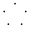

# Testcontainers for Python

<strong>Not using Python? Here are other supported languages!</strong>

    <a href="https://java.testcontainers.org/" class="card-grid-item">Java</a>
    <a href="https://golang.testcontainers.org/" class="card-grid-item">Go</a>
    <a href="https://dotnet.testcontainers.org/" class="card-grid-item">.NET</a>
    <a href="https://node.testcontainers.org/" class="card-grid-item">Node.js</a>
    <a class="card-grid-item">Python</a>
    <a href="https://docs.rs/testcontainers/latest/testcontainers/" class="card-grid-item">Rust</a>
    <a href="https://github.com/testcontainers/testcontainers-hs/" class="card-grid-item" >Haskell</a>
    <a href="https://github.com/testcontainers/testcontainers-ruby/" class="card-grid-item" >Ruby</a>

## About Testcontainers For Python

_Testcontainers for Python_ is a Python library that makes it simple to create and clean up container-based dependencies for automated integration or smoke tests. The easy-to-use API enables developers to programmatically define containers that should be run as part of a test and clean up those resources when the test is done.

To start using _Testcontainers for Python_, see the [quickstart guide](quickstart.md).

!!!note

    If you need a high-level explanation of _Testcontainers_, see the [main website](https://testcontainers.com/getting-started/).

## Code Comments

Inline documentation and docs where the code lives are crucial for us. Testcontainers For Python follows the [PEP 257](https://peps.python.org/pep-0257/){:target="\_blank"} comment conventions. The codebase previously supported Sphinx, so you may encounter comments not yet updated for the new documentation style.

## Who Is Using Testcontainers Python?

- [Timescale](https://www.timescale.com/) - Uses testcontainers-python in their pgai project for testing PostgreSQL integrations, AI model interactions, and AWS service integrations.
- [Redis](https://redis.io/) - Depends on testcontainers-python for their Redis vector library implementation.
- [Apache](https://skywalking.apache.org/) - Uses testcontainers-python in their Skywalking project for an application performance monitoring tool in distributed systems.

## License

See [LICENSE](https://raw.githubusercontent.com/testcontainers/testcontainers-python/refs/heads/main/LICENSE.txt){:target="\_blank"}.

## Attributions

## Copyright

Copyright (c) 2015-2021 Sergey Pirogov and other authors.

See [AUTHORS](https://github.com/testcontainers/testcontainers-python/graphs/contributors){:target="\_blank"} for contributors.
